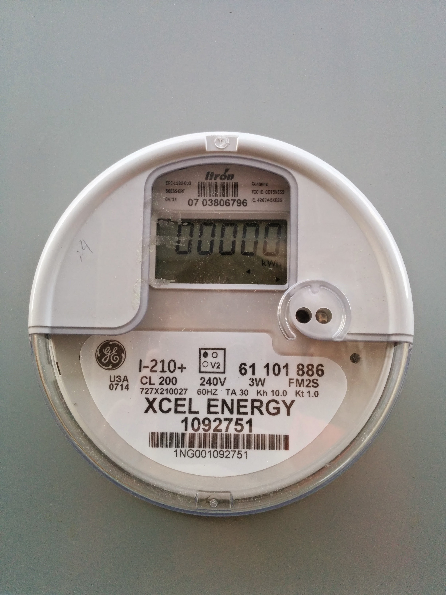

# rtl-sdr-pi
power meter reading

### hardware
1. raspberry pi 3b+
1. [sdr tv card](https://www.amazon.com/NooElec-RTL-SDR-RTL2832U-Software-Packages/dp/B008S7AVTC/)

### tl/dr install notes

- install/compile [rtl-sdr](https://osmocom.org/projects/rtl-sdr/wiki/Rtl-sdr).
  - commands in the doc look like
    - cd rtl-sdr/
    -  mkdir build 
    - cd build
    -  cmake ../ -DINSTALL_UDEV_RULES=ON
    -  make
    -  sudo make install
    -  sudo ldconfig
  - blacklist an additional module
    - vim /etc/modprobe.d/blacklist-rtl8xxxu.conf
    - add `blacklist dvb_usb_rtl28xxu` 
- install `go get github.com/bemasher/rtlamr` (go < 1.16 that comes with raspian)

### to test
- on window run `rtl_tcp`
- in another run `./rtlamr-pi -format=json -filterid=3806796,65560195` 

### meters
#### filter id 3806796

#### filter id 65560195
???